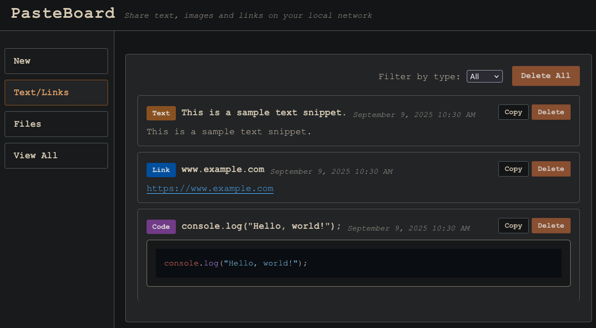

# PasteBoard

A simple, real-time collaborative paste board application running in a Docker container. This application is useful for sharing information between devices on your local network.

> **Note**: Built and deployed via GitHub Actions to GitHub Container Registry.

## Features

- Real-time updates using Socket.IO
- Text and URL detection
- File upload support
- Persistent storage with SQLite



## Getting Started

### Prerequisites

- Docker and Docker Compose

### Running the Application

#### Option 1: Use Prebuilt Docker Hub Image

1. Make sure your `docker-compose.yml` uses the image `ghcr.io/thvnd3r/pasteboard:latest` (already set by default).

or 

1. Copy the Docker Compose example below:

   ```Docker Compose
      services:
     pasteboard:
       image: ghcr.io/thvnd3r/pasteboard:latest
       ports:
         - "3000:3001" # (Optional) Change the left side, to use a different port on your host machine.
       volumes:
         - ./uploads:/app/uploads
         - ./server/pasteboard.db:/app/pasteboard.db
       environment:
         - NODE_ENV=production
   ```

3. Access the application at `http://localhost:3000`.


#### Option 1: Build Locally

1. Build and start the application:
   ```bash
   docker-compose up --build
   ```

2. Access the application at `http://localhost:3000`

## API Endpoints

### API Endpoints

- `GET /api/content` — Get all content
   - Optional: `?type=text|link|code|image|file` to filter by content type
   - Example: `/api/content?type=image`

- `POST /api/content/text` — Add text content
   - Body: `{ "content": "your text or link or code" }`
   - Returns: JSON with new content info

- `POST /api/content/file` — Upload one or more files
   - Form field: `file` (can be multiple)
   - Returns: JSON array of uploaded file info

- `DELETE /api/content/:id` — Delete a specific content item by ID
   - Example: `DELETE /api/content/5`

- `DELETE /api/content` — Delete all content

#### Notes
- All responses are JSON. Errors return an `error` field.
- File uploads use multipart/form-data.
- Content types: `text`, `link`, `code`, `image`, `file`.

#### Example: Upload a file with curl

```sh
curl -F "file=@/path/to/yourfile.png" http://localhost:3000/api/content/file
```

> **Note:** You only need to change `/path/to/yourfile.png` to the file you want to upload. The server will     automatically detect the file type (image, file, etc.) and handle it appropriately.

#### Example: Add text content with curl

```sh
curl -H "Content-Type: application/json" -d '{"content":"Hello world!"}' http://localhost:3000/api/content/text
```

> **Note:** You only need to change the value of `content`. The server will automatically detect if your input is plain text, a link, or code, and tag it accordingly.
